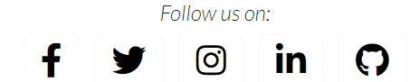

# __Car Talk Blog - Portfolio Project 4__

Car Talk Blog is a blog where users can register an account which allows them to like/unlike posts, comment on a post and once logged in users can upload their own post and also edit/delete their post.

The aim of this project is for users to easily sign up and connect with other users on the blog by liking and commenting on eachothers posts.

[Live link to website](https://car-talk-blog.herokuapp.com/)

## UX 

Some of the colours I used when developing this site, I kept the colours simple so it wouldnt distract the users from the site.

- `#23BBBB` used for the authors name appearing on the image card when viewed on the home page.
- `#445261`  used for when the user clicks on the image card to view the blog details.
- `#E84610` used for when the user hovers over the title of the blog on the home page and also for the like button.
- `#23BBBB` used for the background colour for the sign up / sign in button.

## Typography

[Lato and Road Rage](https://fonts.google.com/) waa used for the site text.
[Font Awesome](https://fontawesome.com/) was used for the icons seen throughout the site.

## User Stories

### Registered users

- As a Site User I can register an account so that I can post, comment and like. `(MUST HAVE)`
- As a Site User I can click on a post so that I can read the full text. `(MUST HAVE)`
- As a Site User I want to be able to Logout of my account and to be Notified when I do. `(MUST HAVE)`
- As a Site User I can leave comments on a post so that I can be involved in the conversation. `(SHOULD HAVE)`
- As a Site User I can like or unlike a post so that I can interact with the content. `(SHOULD HAVE)`
- As a Site User I want to be able to Upload a picture so other people can like/comment in it. `(SHOULD HAVE)`
- As a user I would like to be able to edit and delete posts that I have uploaded. `(SHOULD HAVE)`
- As a Site User / Admin I can view the number of likes/comments on each post so that I can see which is the most popular or viral. `(MUST HAVE)`
- As a user I would like to be bale to share other users post. `(WONT HAVE)`
- As a user I would like to be able to have my own profile page. `(WONT HAVE)`
- As a Site User I want to be able to Login using different social accounts. `(WONT HAVE)`

### Site admin

- As a Site Admin I can create, read, update and delete posts so that I can manage my blog content. `(MUST HAVE)`
- As a Site Admin I can approve or disapprove comments so that I can filter out objectionable comments. `(MUST HAVE)`
- As a Site Admin I can create draft posts so that I can finish writing the content later. `(SHOULD HAVE)`
- As a Site User / Admin I can view the number of likes/comments on each post so that I can see which is the most popular or viral. `(MUST HAVE)`

## Wireframes

I used [balsamiq](https://balsamiq.com/wireframes) to design my site wireframes.

### Home page wireframes

Click to view home page wireframes

#### Mobile

#### Tablet

#### Desktop

#### Admin

### Sign up

Click here to view sign up wireframe

### Sing up

### Sign in

Click here to view sign in wireframes

### Sing in

### Create a post

Click here to view create a post wireframes

### Create a post

### Comment section

Click here to view comment section wireframes

### Comment section

### Edit and delete post

Click here to view edit and delete post

### Edit and delete post

### Delete post author

Click here to view edit and delete post

### Delete post author

## Features

### Existing features

- **Home page Logged out**

    - When users visit the blog they have a home, register and login navigation, users can see the blog posts including the author, time and date when the post was uploaded and the numbers of likes.

    

- **View post logged out**

    - When the user clicks on a blog post they get to see more information about the post and also can see the number of likes and comments.

    

- **Comment section logged out**

    - Users can see comments underneath the blog post with the name of the user that uploaded the blog with the time and date.

    

- **Site pagination**

    - There is a next button at the bottom which appears when the page has more than 6 posts.

    

- **Sign up**

    - When users register an account they will be asked to enter a username, email address and password.

    

- **Must fill in**

    - If a user does not fill in all required fileds when registering an account a message will appear.

    

- **Sign in meaasge**

    - When the user logs in a sign in message will appear for a few seconds.

    

- **Sign in**

    - When users sign in they will be asked for their username and passowrd and if enetered incorrectly they will be notified there also a remember me button if they user wants to have thir username and password saved.

    

- **Dropdown menu**

    - when users are logged in a dropdown menu will appear with a list option which will bring them to a list of the posts from new to old and a create navigation which will allow the user to create a post.

    

- **Comment section logged in**

    - When the user is logged in they are able to comment on another users post which will have to be approved by the admin before appearing in the comment section.

    

- **Approval comment**

    - Users will be shown an awaiting approval message when they comment on a post.

    

- **Create a post**

    - When the user is logged in they are able to create a post with a title, description, upload an image and a  publish or draft button.

    

- **Edit and delete author**

    - If the user wants to delete or edit a post its has to be their own post. An edit and delete button will be shown underneath their post.

    

- **Delete post comformation**

    -If the author of the post presses the delete button they will be a brought to a comfirmation page.

    

- **Sign out comfirmation**

    - A sign out comfirmation message will be shown when the user wants to sign out

    

- **Sign out message**

    - When the user signs out they will be notified with a message.

    

- **Admin logged in**

    - When the admin/superuser is logged in an admin navigation will be shown which will bring them to the admin pannel as quicker access.

    

- **Footer**

    - The footer section is where users can open up social accounts.

    

### Future features

These are some of features which can be implemented in the future. These features have be logged as wont have in my MoSCoW prioritization.

- Social accounts
    - I would like to add a feature which allows users to log in using differnet social accounts.
- Profile page
    - I would like to be bale to add a feature which allows users to make a profile page.
- Share posts
    - I would like to add a feature which allows users to share eachothers posts.

## Database design

I created an entity relationship diagram using [balsamiq](https://balsamiq.com/wireframes). This help me to understand the database design.

### Entity relationship diagram

## Tools and technologies used

- [HTML](https://en.wikipedia.org/wiki/HTML) was used for the main site content.
- [CSS](https://en.wikipedia.org/wiki/CSS) was used for the design and layout.
- [bootstrap](https://getbootstrap.com/) was used for the front-end CSS framework responsiveness and pre-built components.
- [JavaScript](https://en.wikipedia.org/wiki/JavaScript) was used for the user interaction on the site for automatically closing Django messages.
- [Python](https://en.wikipedia.org/wiki/Python_(programming_language)) was used as the back-end programming language.
- [GitHub](https://github.com/) was used for secure online code storage.
- [Gitpo](https://www.gitpod.io/) was used as a cloud-based IDE for development.
- [Django](https://www.djangoproject.com/) was used as the python framwork for the site.
- [PostgreSQL](https://www.postgresql.org/) was used as the relational database management.
- [ElphantSQL](https://www.elephantsql.com/) was used as the postgres database.
- [Heroku](https://www.heroku.com/) was used as hosting the deployed back-end site.
- [Cloudinary](https://cloudinary.com/) was used for online static storage.
- [Balsamiq](https://balsamiq.com/wireframes/) was used for to design my site wireframe.
- [Google fonts](https://fonts.google.com/) was used for my fonts throughout my site.
- [Font awesome](https://fontawesome.com/) was used for my icons I used throughout my site.

## Agile developemnt 

### GitHub projects

[GitHub Projects](https://github.com/AdamRalph123/Car-talk-blog/projects?query=is%3Aopen) served as an agile tool for this project. User stories were used to map out the development progress of this project, It helped me to understand what was nedded to be done and what was done.

### GitHub issues

[Github issues](https://github.com/AdamRalph123/Car-talk-blog/issues) served as anothet agile tool.

 has a label of **Wont have** as these issues will be implemented in the future.

 has labaels of **Must have** and **Should have** which is what the site must contain and what the site should contain.

### MoSCow prioritization

- **Must have**: The 'MUST' level requirements are those requirements which will definitely be included to be delivered.
- **Should have**: The 'SHOULD' level requirements are those requirements which should be included if at all possible. If the project has capacity and time and it will not jeopardise any of the 'must have' requirements.
- **Could have**: The 'COULD' level requirements are the requirements which could be included if it doesnt have any impact on any of the 'should' or 'must' requirements.
- **Wont have**: The 'WONT' level requirements tend to be the requirements which will not be  included or implemented this time but are requirements that would be favoured for a future delivery or implementation.

## Testing

For all testing, please refer to the [TESTING.md](TESTING.md) file.

## Bugs

There was not any major bugs while working on this site, some were just simple spelling mistakes, which would cause a certain page to not open.

### Fixed bugs

user.username to author comparison did not work with user.username == post.author, so I found I had to compare user == post.author. Thanks to [stackoverflow](https://stackoverflow.com/questions/43879330/djangounable-to-compare-the-logged-in-user-with-the-author-of-the-post).

There are no known bugs left on this site.

## Deployment 

The live deployed application can be found on [Heroku](https://git.heroku.com/car-talk-blog.git).

### ElpephantSQL 

This project uses [ElephantSQL](https://www.elephantsql.com/) for postgreSQL database.

To obtain your own Postgres database, sign-up with your GitHub account, then follow these steps:
- Click **Create new instance** to start a new database.
- Provide a name, this is commonly the name of your project.
- Select the **Ting turtle plan** as this is free.
- You can leave the **tags** blank.
- Select the **Region** and **Data center** closest to you.
- Once created, you can click on the nee database name where you can view the database URL and password.

### Cloudinary API 

This project uses the [Cloudinary API](https://cloudinary.com/) to store media assets online.

To obtain your own cloudinary API key, create an account and log in.
- For **Primary interest**, you can choose **programmable media for image and video API**.
- On your cloudinary dashboard, you can copy your **API enviroment variable**.

### Heroku Deployment

This project uses [Heroku](https://www.heroku.com/), a platform as a service that enables developers to build, run and operate applications entirely in the cloud.

- Select **new** in the top-right hand corner in your heroku dashboard and select **create new app** from the dropdown menu.
- Your app name must be unique, then choose the region closest to you, then slect **create app**.
- From the new app settings, click **reveal config vars** ans set your enviroment variables.

| Key | Value |
| --- | --- |
| `CLOUDINARY_URL` | Insert your own API key here. |
| `DATABASE_URL` | insert your own ElephantSQL database url here. |
| `DISABLE_COLLECTSTATIC` | 1 (*this is temporary and can be removed on your final deployment*) |
| `SECRET_KEY` | This can be any random secret key. |
| `PORT` | 8000 |

Heroku needs two additional files in order to deploy properly.
- requirements.txt file.
- Procfile.

You can install this projects ** requirements** using:
- `pip3 install -r requirements.txt`

If you have your own package that have been installed , then the requirements file needs updating using:
- `pip3 freeze --local > requirements.txt`

The **profile** can be created with the following command:
- `echo web: gunicorn app_name.wsgi > Profile`
- Make sure to replace 'app_name' with the name of your **own** app name.

For Heroku deployment, follow these steps to deploy your site:

- **Automatic** select 'enable automatic deployment'.
- **Manual deployment** can be done by:
    - By typing `heroku login -i` in the terminal.
    - Set the remote for heroku: `heroku git:remote -a app_name` replace 'app_name' with your own app name.

### Cloning 

You can clone this repository by follwoing these steps:

- Go to the [GitHub repository](https://github.com/AdamRalph123/Car-talk-blog).
- Locate the code button above the list of files and click it.
- Select if you prefer to clone using HTTPS, SSH or GitHub CLI and click copy button to copy the URL to your clipboard.
- Open Git bash or Terminal.
- Chanhe the current working directory to the one you the clonned directory.
- In your IDE terminal, type the following command to clone the repository: `git clone https://github.com/AdamRalph123/Car-talk-blog`.
- Press enter to create your clone.

### Forking

By forking this GitHub repository, you make a copy of the original repository on your GitHub account to view or makw chnages to it without affecting the ownders repository.

Follow these steps to fork this repository:

- Login into GitHub and locate [GitHub repository](https://github.com/AdamRalph123/Car-talk-blog).
- At the top of the repository Just above the **settings** button on the menu, locate the **fork** button.
- Once clicked, you should now have a copy of the original repository in your own GitHub account.

## Credits

I would like to credit [Code Institute](https://codeinstitute.net/) for allowing us to use the *I think therefore I blog* practice project as a base to our own blog.

### Content

| Source | Location | Notes |
| --- | --- | --- |
| [Prepopulate a Form Field Using Slugs and Integers](https://lookaway.info/zine/information/prepopulate-a-form-field-using-slugs-and-integers-django-20210410/) | view.py file | to help with slugs and integers. |
| [Pexels](https://www.pexels.com/) | base.html, index.html, post detail.html and uploading posts | was used for downloading images that was used to upload to my blog. |
| [Bootstrap](https://getbootstrap.com/) | base.html, index.html, post detail.html | was used for the front-end CSS framework responsiveness and pre-built components. |
| [Footer](https://mdbootstrap.com/docs/standard/extended/social-media-icons-footer/) | base.html | was used for creating my footer. |

 ##  Acknowledgement
 I would like to thank:
 
 - My mentor Jubril Akolade who is always there for support and to answer any questions i have for him.
 - I would like to thank [Code Institute](https://codeinstitute.net/) student support for always helping me to solove my errors.
 - The slack community (https://slack.com/intl/en-ie/https://slack.com/intl/en-ie/) which i can always rely on.
 - I would like to thank the assessment team for taking their time to look over my project.