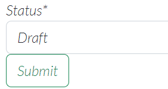

# Testing

Return back to the [README.md](README.md) file.

## Code validation

### HTML

I have used the recommened [HTML w3c validator](https://validator.w3.org/) to test and validate all of my html files.

As my project uses Jinja syntax such as, `` and `` if will not validate properly if I copy and paste my code straight from my workspace.

In order to properl validate my HTML pages with Jinja syntax for authenticated pages, I followed these steps.

- Navigate to the deployed page which requires authentication.
- Right click anywhere on the page and select **View page source** or `CTRL+U`.
- This will display the compiled code without any Jinja syntax.
- Copy all the code (CTRL+A) and use the [Validate by input](https://validator.w3.org/#validate_by_input)

| Pages | Screenshots | Notes |
| --- | --- | --- |
| Home |  | Pass: no errors |
| Sign up |  | Pass: no errors |
| Sign in |  | Pass: no errors |
| Sign out |  | Pass: no errors |
| View post |  | Pass: no errors |
| View post as author |  | Pass: no errors |
| Create post |  | Pass: no major errors |
| Delete post as author |  | Pass: no major errors |

### CSS
 
 I have used the recommneded [CSS Jigsaw validator](https://jigsaw.w3.org/css-validator/) to validate my css file.

| File | Screenshot | Notes |
| --- | --- | --- |
| style.css |  | Pass: no errors |

### JavaScript

I have used [JShint validator](https://jshint.com/) to validate my javascript code that is found in my base.html file.

| File | Screenshot | Notes |
| --- | --- | --- |
| Base.html |  | Pass: no errors |

### Python

I have used [CI Python linter](https://pep8ci.herokuapp.com/) to validate all of my python files.

| File | Screenshot | Notes |
| --- | --- | --- |
| Settings |  | Pass: no errors |
| Models |  | Pass: no errors |
| Manage |  | Pass: no errors |
| Views |  | Pass: no errors |
| Forms |  | Pass: no errors |
| Admin |  | Pass: no errors |
| Apps |  | Pass: no errors |
| Urls 1 |  | Pass: no errors |
| urls 2 |  | Pass: no errors |

## Responsivness

I have checked my deployed site on phone and tabelt to make sure each page was responsive.

| Page | Phone | Tablet |
| --- | --- | --- |
| Home page |  |  |
| Sign up page |  |  |
| Sign in page |  |  |
| Sign out page |  |  |
| Create post page |  |  |
| Edit and delete post page |  |  |

## Lighthouse audit

I have tested my deployed site using the lighthouse audit tool to check for any major issues.

| Page | Screenshot | Notes |
| --- | --- | --- |
| Home page |  | Some minor warnings |
| Sign up page |  | No major warnings |
| Sign in page |  | No major warnings |
| Sign out page |  | Some minor warnings |
| View blog page |  | Some minor warnings |
| Create post page |  | Some minor warnings |
| Deelete post page |  | Some minor warnings |

## Manual testing

Manual testing is used below to make sure the sites functionality is working and deos not crash.

| Page | User action | Expected result | Pass/fail |
| --- | --- | --- | --- |
| Home page | Click on logo | Redirected to home page | Pass |
| Sign up | Click on Register navigation | Brings user to sign up page. User is asked to enter username, email address and password. Click submit, user is directed to home page. | Pass |
| Sign in | Click on Sign in navigation | Redirected to sign in page. User must enter the correct Sign in details. When entered correctly users will be directed to the home page with a message appearing to let the user know they are signed in. | Pass |
| Sign out | Click on sign out navigation | User will be redirected to a sign out comfirmation page. When user signs out they will be brought to the home page with a message appearing to let the user know they are signed out. | Pass |
| Comment on post | Type comment and submit | users can only comment on a post when they are logged into their account. Wgen typing out a comment and pressing submit, users will be notified that their comment is awaiting approval. | Pass |
| Craete post | Click on creat navigation when logged into account | Users will be brought to the create a post page which will be asked to eneter their post details. After pressing submit, users can then see their blog post on the home page. | Pass |
| Delete post author | Author clicks on delete button | When the author clicks on the delete button they will be redirected to a delete post comfirmation page. When the user presses delete they will see their post has been removed from the home page. | Pass |
| Edit post author | Click on edit button | Author clicks on edit button. Author will be redirected to the create a post page which will be their original post that they want to edit. | Pass |
| Home page admin | Logged in as admin | When the admin is logged in an admin navigation will appear which gives the admin quicker access to the admin panel. | Pass |

## User story testing 

I have tested each user story below including screenshots.

| User story | Screenshot |
| --- | --- |
| As a user I would like to be able to edit and delete posts that I have uploaded. |  |
| As a Site User / Admin I can view the number of likes/comments on each post so that I can see which is the most popular or viral. |  |
| As a Site User I want to be able to Upload a picture so other people can like/comment in it. |  |
| As a Site Admin I can create draft posts so that I can finish writing the content later. |  |
| As a Site Admin I can approve or disapprove comments so that I can filter out objectionable comments. |  |
| As a Site Admin I can create, read, update and delete posts so that I can manage my blog content. |  |
| As a Site User I can click on a post so that I can read the full text. |  |
| As a Site User I can like or unlike a post so that I can interact with the content. |  |
| As a Site User I can leave comments on a post so that I can be involved in the conversation. |  |
| As a Site User I want to be able to Logout of my account and to be Notified when I do. |  |
| As a Site User I can register an account so that I can post, comment and like. |  |

The following are user stories that I was not able to implement and are labeled as wont have.

| User story | Screenshot |
| --- | --- |
| As a user I would like to be bale to share other users post. | N/A |
| As a user I would like to be able to have my own profile page. | N/A |
| As a Site User I want to be able to Login using different social accounts. | N/A |

